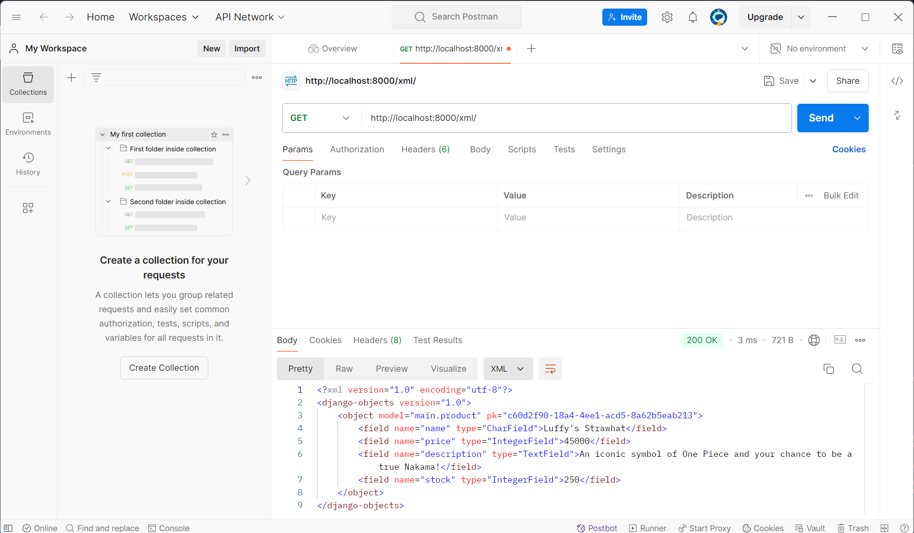
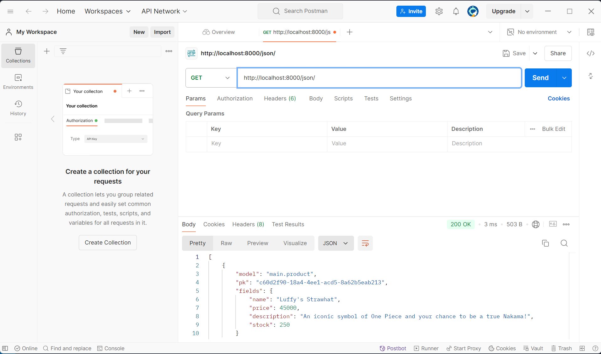
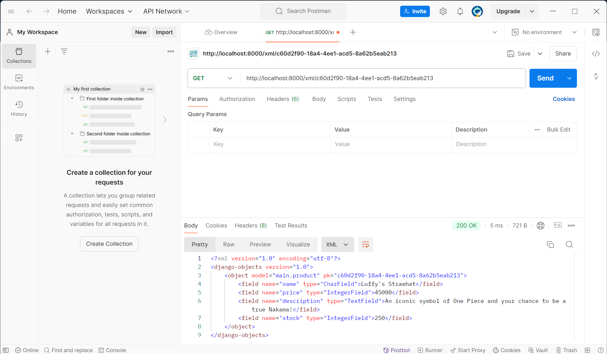
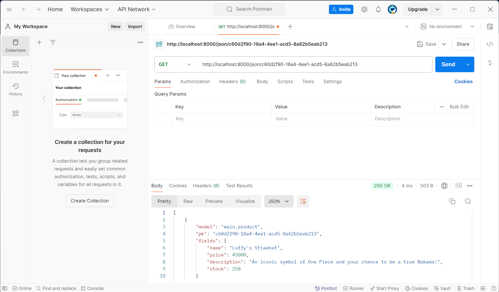

LINK TO PWS : http://serafina-nala-nakamacollective.pbp.cs.ui.ac.id/

ASSIGNMENT 2

1. Question : Explain how you implemented the checklist above step-by-step! 

Answer : To start implementing the checklists for the assignment, I first created a folder and named it "nakama-collective" after the shop I envisioned. I then opened the directory in Visual Studio Code and initialized the terminal to create a virtual environment using the command python -m venv env. After activating the virtual environment with env\Scripts\activate, I created a requirements.txt file within the same directory and listed the necessary dependencies. Using pip install -r requirements.txt, I installed those dependencies. Next, I set up a Django project, making sure to add ["localhost", "127.0.0.1"] to the settings to allow access from the local host. Before running python manage.py runserver, I verified that the manage.py file was in the active directory. Once the server was running, I opened http://localhost:8000 in my web browser, confirming the successful creation of the Django application. After this, I stopped the server with Ctrl+C and deactivated the virtual environment. To upload the project to GitHub, I created a public repository named "nakama-collective" and initiated the local directory as a Git repository. I added a .gitignore file. After that, I used git add, git commit, and git push to upload the project to GitHub. 

With the repository set up, I proceeded to create a new Django application named "main" using python manage.py startapp main. I registered the app in the INSTALLED_APPS section of the settings.py file and created a templates folder within the "main" directory, adding a main.html file. Then, I opened models.py and added a Product model with attributes for the product name, price, and description. In views.py, I defined a show_main view to render the main.html template with some context data, including the application name, class, and name of the user. In the urls.py file of the "main" app, I added the necessary paths to link the view to the root URL. I also updated the main urls.py file in the project directory to include the "main" app's URLs. Then, I ran the Django server again with python manage.py runserver and checked http://localhost:8000 to view the page, which displayed the data correctly using Django's templating system. To continue, I accessed the PWS page at https://pbp.cs.ui.ac.id, which redirected me to the login page. After successfully logging in, I created a new project by clicking the "Create New Project" button. This took me to a page where I could enter the project details. I named the project and then pressed the "Create New Project" button to proceed. Finally, I updated the settings.py file in my Django project by adding the PWS deployment URL to the ALLOWED_HOSTS field, allowing the application to be deployed correctly. Once this was done, I pushed the project to the PWS repository for deployment.

2. Question : Create a diagram that contains the request client to a Django-based web application and the response it gives, and explain the relationship between urls.py, views.py, models.py, and the html file.

Answer : 

3. Question : Explain the use of git in software development!

Answer : In software development, Git can be used to manage and track changes to code. It allows multiple developers to work on the same project without messing up each other's work. Git keeps a record of every change made, so it allows developers to return to previous versions if needed.

4. Question : In your opinion, out of all the frameworks available, why is Django used as the starting point for learning software development?

Answer: Django is often used as a starting point for learning software development because it's a powerful and beginner-friendly framework. One of the main reasons is that Django is built on Python, a language known for its simplicity and readability, making it easier to learn. Django also comes with a lot of built-in features like user authentication, databases, and security measures, which saves time and helps beginners focus on understanding how web applications work instead of building everything from scratch. Additionally, Django enforces good practices like code organization and reusability, which are essential for new developers to learn early on. This structure helps beginners create complex projects without getting overwhelmed. It’s also widely used in the real world, so learning Django gives students skills they can use in professional environments.

5. Question : Why is the Django model called an ORM?

Answer : Because it allows developers to interact with databases using Python code instead of SQL. It translates database tables into Python objects, simplifying the process of managing data without the need for complex queries.

ASSIGNMENT 3

1. Question : Explain why we need data delivery in implementing a platform!

Answer : Data delivery is crucial for a platform because it ensures information moves quickly and accurately between users and the system. When users send messages or search for content, the data needs to travel to the server and back efficiently. Good data delivery keeps everything working smoothly, supports real-time updates, and handles growing numbers of users. Without it, the platform could become slow or unreliable.

2. Question : In your opinion, which is better, XML or JSON? Why is JSON more popular than XML?

Answer : In my opinion, JSON is better than XML because it’s simpler and easier to read. JSON’s lightweight format is less complex, making data interchange more efficient. It also maps directly to common data structures like objects and arrays, which simplifies integration with modern programming languages. This simplicity and efficiency are why JSON is more popular than XML.

3. Question : Explain the functional usage of is_valid() method in Django forms. Also explain why we need the method in forms!

Answer : The is_valid() method in Django forms checks if the submitted data meets all the form's validation rules. It returns True if the data is valid and False if there are errors. We need this method to ensure data integrity, provide user feedback on input errors, and maintain security by preventing invalid or harmful data from being processed.

4. Question : Why do we need csrf_token when creating a form in Django? What could happen if we did not use csrf_token on a Django form? How could this be leveraged by an attacker?

Answer : The csrf_token is needed in Django forms to protect against Cross-Site Request Forgery (CSRF) attacks. CSRF attacks trick users into submitting forms on a website without their knowledge, potentially performing harmful actions. Without csrf_token, an attacker could exploit this vulnerability to perform unauthorized actions on behalf of users, such as changing settings or making transactions. Using csrf_token ensures that the form submissions are legitimate and come from the actual user.

5. Question : Explain how you implemented the checklist above step-by-step (not just following the tutorial).

Answer : To update my Django project, I started by creating a directory named templates in the main directory (root folder) and added a new HTML file called base.html. This base.html file serves as a base template for other web pages in the project. I included basic HTML structure and template tags for static files and content blocks. Next, I modified the settings.py file to ensure Django recognizes the base.html file by adjusting the TEMPLATES variable to include 'DIRS': [BASE_DIR / 'templates'].

In the main/templates/ subdirectory, I updated main.html to extend from base.html and included content blocks for displaying the application name, user name, and class. I then improved the Product model by adding import uuid at the top of models.py and including a UUID field with id = models.UUIDField(primary_key=True, default=uuid.uuid4, editable=False). To apply these changes, I ran python manage.py makemigrations and python manage.py migrate to update the database schema. 

To continue with the project, I started by creating a forms.py file in the main directory to define the structure of the form for adding new products. I then updated views.py by importing render and redirect from Django’s shortcuts. I created a new function named create_product to handle the form submission. This function checks if the form is valid and, if so, saves the new product and redirects to the main view.

Next, I modified the existing show_main function in views.py to fetch and display all product entries from the database. I updated the urls.py file to import the create_product function and added the corresponding URL path to handle form requests. In the main/templates directory, I created a new HTML file named create_product.html with a form for adding products, ensuring to include CSRF protection.

I then updated main.html to display product data in a table format and added a button to navigate to the form for adding new products. After running the Django server with python manage.py runserver, I accessed http://localhost:8000/ to verify the changes.

Following this, I added imports for HttpResponse and serializers in views.py and created a function named show_xml to serialize and return product data in XML format. I updated urls.py to include a path for accessing this XML view. Similarly, I created a show_json function for JSON serialization and updated urls.py with a path for this JSON view.

I then created two new functions, show_xml_by_id and show_json_by_id, to return individual product data in XML and JSON formats, respectively. I updated urls.py to include paths for these views by ID. Finally, I ran the server again and tested the new endpoints at http://localhost:8000/xml/[id]/ and http://localhost:8000/json/[id]/ to ensure everything was functioning correctly.

6. Access the four URLs in point 2 using Postman, take screenshots of the results in Postman, and add them to README.md

ASSIGNMENT 3

1. Question : What is the difference between HttpResponseRedirect() and redirect()?

Answer : In Django, both HttpResponseRedirect() and redirect() are used to send users to a different page, but redirect() is more flexible. While HttpResponseRedirect() requires a specific URL, redirect() can work with URLs, page names (views), or even model objects. This makes redirect() easier to use and better for larger projects where you might not want to hardcode every URL. In most cases, it's the smarter choice because it handles more situations with less effort.

2. Question : Explain how the MoodEntry model is linked with User!

Answer : The NakamaEntry model is connected to the User model through a foreign key relationship. This means that each NakamaEntry, which represents a product, is tied to a specific user, allowing us to identify who created which product. In the Product model, the user field acts as a foreign key that references the User model. This setup allows multiple products to be associated with a single user while ensuring that each product is linked to only one user. When a user creates a new product, it automatically connects to their account, streamlining the management and display of user-specific information within the application.

3. Question : What is the difference between authentication and authorization, and what happens when a user logs in? Explain how Django implements these two concepts.

Answer : Authentication is about verifying who you are, while authorization is about controlling what you can do. When a user logs in, authentication checks if their username and password match to confirm their identity. After that, authorization determines what actions or areas of the site they are allowed to access, based on their permissions. In Django, authentication is handled with the login system, where users provide credentials, and Django verifies them. Authorization is handled through permissions and groups, which define what each user is allowed to do, like accessing certain views or modifying data.

4. Question : How does Django remember logged-in users? Explain other uses of cookies and whether all cookies are safe to use.

Answer : Django remembers logged in users through session cookies. When a user logs in, Django stores a special cookie in their browser that has a unique ID, which it uses to track their session and keep them logged in across pages. Cookies are small pieces of data stored in the browser, used for things like remembering login details, preferences, or tracking website activity.

However, not all cookies are safe. Some can be used to track users without their consent or carry security risks if not handled correctly, like storing sensitive data. That’s why Django uses secure cookies for login sessions to help keep user information safe.

5. Question : Explain how did you implement the checklist step-by-step (apart from following the tutorial).

Answer : First, I opened the views.py file in the main subdirectory of my project and added imports for UserCreationForm and messages. Then, I included a register function that automatically generates a registration form and creates a user account when the form data is submitted. The function checks if the request is a POST request, validates the form, saves the user, and displays a success message once the account is created. Afterward, I added the form context and rendered the register.html file to display the form. Next, I created a new HTML file named register.html in the main/templates directory to handle the user registration view. I also opened urls.py, imported the register function, and added a URL path to urlpatterns so the registration function could be accessed.

After setting up registration, I reopened views.py to add imports for authenticate, login, and AuthenticationForm. I then created the login_user function, which handles user authentication. Once the login.html file was created in the main/templates directory, I updated urls.py by importing login_user and adding the corresponding URL path to urlpatterns. Following that, I went back to views.py to import logout and added a logout_user function, which allows users to log out, clears their session, and redirects them to the login page. I updated the main.html file by adding a logout button using the  syntax.

Then I returned to urls.py, imported the logout_user function, and added its URL path to urlpatterns to enable logout functionality. Next, I reopened views.py to import login_required. I applied the @login_required(login_url='/login') decorator to the show_main function, ensuring that only authenticated users could access the main page. After that, I logged out of the Django application to test everything. Additionally, I imported HttpResponseRedirect, reverse, and datetime at the top of views.py and modified the login_user function to set a cookie named last_login after successful login attempts. Finally, I updated the logout_user function to delete the last_login cookie when users logged out. To complete everything, I updated main.html once again by adding a line of code to display the last login time after the logout button, allowing users to see their most recent login session.

Once everything was set up, I refreshed the login page, successfully logged in, and confirmed that the last login information was being displayed on the main page. Next, I opened models.py, imported the User model from django.contrib.auth.models, and modified the model to include a ForeignKey relationship. Next, I updated the show_main function to filter so only those created by the logged-in user would be displayed. I also passed the username to the context for display on the main page. After completing the changes, I saved my work and ran the migration process using python manage.py makemigrations. As expected, I encountered an error due to the new user field. I selected option 1 to set a default value for the user field, assigning the user with ID 1 to all existing entries. Then, I ran python manage.py migrate to apply the changes. Finally, I prepared the project for production. I opened settings.py, imported os, and replaced the DEBUG variable with a more flexible setup. This configuration allows the project to toggle between development and production modes based on an environment variable, ensuring DEBUG is only enabled when necessary, making the project safer and ready for deployment.

ASSIGNMENT 5 

1. Question : If there are multiple CSS selectors for an HTML element, explain the priority order of these CSS selectors!

Answer : When several CSS selectors apply to the same element, the browser follows a rule called specificity to decide which styles to use. Inline styles take the top spot, meaning any CSS written directly inside an HTML tag has the most influence. After that, ID selectors are prioritized, followed by class, attribute, and pseudo-class selectors. Finally, element selectors have the least impact. If multiple selectors have the same priority, the one that appears later in the stylesheet will override the others.

2. Question : Why does responsive design become an important concept in web application development? Give examples of applications that have and have not implemented responsive design!

Answer : Responsive design is essential in web development because it ensures that websites adapt to various screen sizes and devices, providing a seamless user experience whether on a desktop, tablet, or smartphone. Without it, users might struggle with navigation or readability, leading to frustration and potentially losing visitors. For example, applications like Facebook and Amazon use responsive design, allowing users to easily browse on any device. In contrast, older websites or apps that haven’t implemented responsive design can appear cluttered or difficult to navigate on smaller screens, like certain outdated government or educational portals.

3. Question : Explain the differences between margin, border, and padding, and how to implement these three things!

Answer : Margin, border, and padding in CSS are important for controlling spacing and layout around an element. Margin is the outermost layer, creating space between the element and any neighboring elements, ensuring they don’t touch. Border is the visible frame around the element, and users can customize its thickness, color, and style. Padding adds space inside the element, between the content (like text or images) and the border, giving the content room to breathe. Users implement these properties using CSS by adding margin: 10px;, border: 2px solid black;, and padding: 15px; to adjust spacing and appearance as needed.

4. Question : Explain the concepts of flex box and grid layout along with their uses!

Answer : Flexbox and Grid Layout are both great for designing responsive websites, but they serve different purposes. Flexbox is ideal for simpler, one-direction layouts, like a navigation bar or horizontal image gallery, where items need to line up neatly in a row or column. For example, an e-commerce website's product listing could use Flexbox to arrange items in a row that adjusts based on screen size. Grid Layout, being more two-dimensional, is perfect for more complex structures like dashboard layouts or photo galleries, where content is arranged in both rows and columns. Websites with detailed content grids, like portfolio sites or news sites, can benefit from using Grid to create flexible, organized layouts.

5. Question : Explain how you implemented the checklist above step-by-step (not just following the tutorial)!

Answer :  I started by opening the base.html file that I had previously created in the templates folder of my Django project. The first step was to ensure that my web page would be responsive on mobile devices, so I added the <meta name="viewport"> tag to base.html. This tag is crucial for making sure that the layout adjusts properly on different screen sizes. Next, I connected my Django template to Tailwind CSS by incorporating the Tailwind CDN (Content Delivery Network) script. I placed this script in the <head> section of my base.html file. This step enables me to utilize Tailwind's utility classes throughout my project without needing to download and host the framework locally.

After setting up the base template, I moved to views.py in the main subdirectory to create a new function called edit_product. This function takes two parameters: request and id. It will handle the logic for editing a product. Alongside this, I created a new HTML file named edit_product.html in the main/templates subdirectory. In this file, I structured the content to allow users to edit their mood, including a form that uses Django's CSRF protection and a submit button. With the edit functionality in place, I turned to urls.py in the main directory. I imported the edit_product function and added a URL path to the urlpatterns. This path enables users to access the edit product functionality at the URL edit-mood/<uuid:id>.

To enhance my project further, I created a delete_product function in views.py, which also takes request and id parameters. This function will manage the deletion of product data. After defining this function, I returned to urls.py, imported delete_product, and added a corresponding URL path to enable access at delete/<uuid:id>.Next, I opened main.html in the main/templates folder and modified the existing code to include a delete button for each product. This addition improves user interaction by allowing users to delete products easily. I also created a new HTML file named navbar.html in the templates folder at the root directory to help structure my navigation.

To optimize my project for serving static files, I opened settings.py and added the WhiteNoise middleware. Additionally, I created a global.css file in the /static/css directory within the root project. Finally, I styled the various HTML files, including login.html, register.html, card_info.html, create_product.html, and edit_product.html. Once I was satisfied with the styles, I ran my Django project using the command python manage.py runserver and opened my web browser to http://localhost:8000 to see the results.