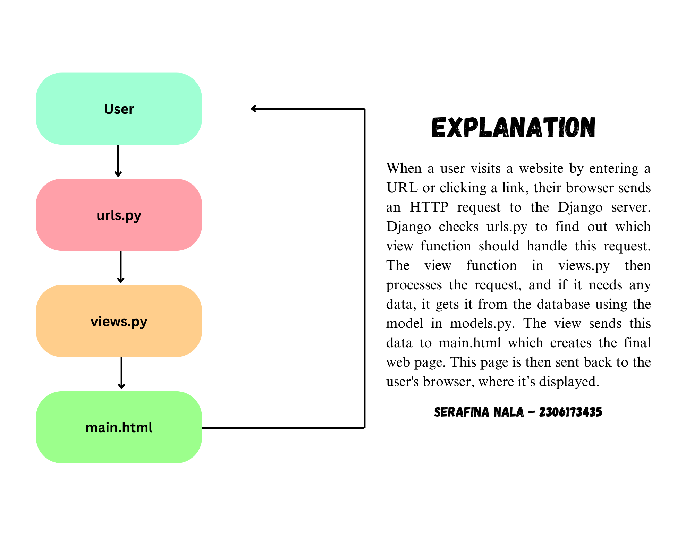

LINK TO PWS : http://serafina-nala-nakamacollective.pbp.cs.ui.ac.id/

1. Question : Explain how you implemented the checklist above step-by-step! 
Answer : To start implementing the checklists for the assignment, I first created a folder and named it "nakama-collective" after the shop I envisioned. I then opened the directory in Visual Studio Code and initialized the terminal to create a virtual environment using the command python -m venv env. After activating the virtual environment with env\Scripts\activate, I created a requirements.txt file within the same directory and listed the necessary dependencies. Using pip install -r requirements.txt, I installed those dependencies. Next, I set up a Django project, making sure to add ["localhost", "127.0.0.1"] to the settings to allow access from the local host. Before running python manage.py runserver, I verified that the manage.py file was in the active directory. Once the server was running, I opened http://localhost:8000 in my web browser, confirming the successful creation of the Django application by seeing the rocket animation. After this, I stopped the server with Ctrl+C and deactivated the virtual environment. To upload the project to GitHub, I created a public repository named "nakama-collective" and initiated the local directory as a Git repository. I added a .gitignore file. After that, I used git add, git commit, and git push to upload the project to GitHub. With the repository set up, I proceeded to create a new Django application named "main" using python manage.py startapp main. I registered the app in the INSTALLED_APPS section of the settings.py file and created a templates folder within the "main" directory, adding a main.html file. I then opened models.py and added a Product model with attributes for the product name, price, and description. In views.py, I defined a show_main view to render the main.html template with some context data, including the application name, class, and name of the user. In the urls.py file of the "main" app, I added the necessary paths to link the view to the root URL. I also updated the main urls.py file in the project directory to include the "main" app's URLs. Then, I ran the Django server again with python manage.py runserver and checked http://localhost:8000 to view the page, which displayed the data correctly using Django's templating system. To continue, I accessed the PWS page at https://pbp.cs.ui.ac.id, which redirected me to the login page. After successfully logging in, I created a new project by clicking the "Create New Project" button. This took me to a page where I could enter the project details. I named the project and then pressed the "Create New Project" button to proceed. Finally, I updated the settings.py file in my Django project by adding the PWS deployment URL to the ALLOWED_HOSTS field, allowing the application to be deployed correctly. Once this was done, I pushed the project to the PWS repository for deployment.

2. Question : Create a diagram that contains the request client to a Django-based web application and the response it gives, and explain the relationship between urls.py, views.py, models.py, and the html file.
Answer : 

3. Question : Explain the use of git in software development!
Answer : In software development, Git can be used to manage and track changes to code. It allows multiple developers to work on the same project without messing up each other's work. Git keeps a record of every change made, so it allows developers to return to previous versions if needed.

4. Question : In your opinion, out of all the frameworks available, why is Django used as the starting point for learning software development?
Answer: Django is often used as a starting point for learning software development because it's a powerful and beginner-friendly framework. One of the main reasons is that Django is built on Python, a language known for its simplicity and readability, making it easier to learn. Django also follows the "batteries-included" philosophy, meaning it comes with a lot of built-in features like user authentication, databases, and security measures, which saves time and helps beginners focus on understanding how web applications work instead of building everything from scratch. Additionally, Django enforces good practices like code organization and reusability, which are essential for new developers to learn early on. This structure helps beginners create complex projects without getting overwhelmed. It’s also widely used in the real world, so learning Django gives students skills they can use in professional environments.

5. Question : Why is the Django model called an ORM?
Answer : Because it allows developers to interact with databases using Python code instead of SQL. It translates database tables into Python objects, simplifying the process of managing data without the need for complex queries.