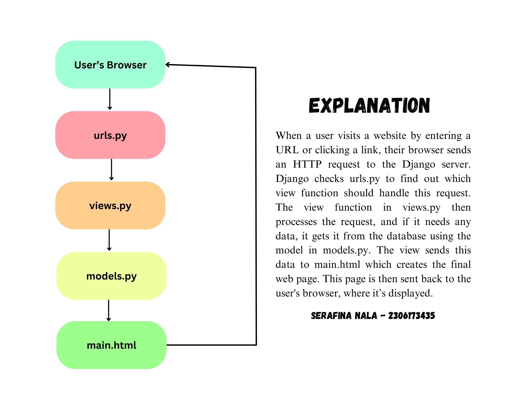

LINK TO PWS : http://serafina-nala-nakamacollective.pbp.cs.ui.ac.id/

ASSIGNMENT 2

1. Question : Explain how you implemented the checklist above step-by-step! 

Answer : To start implementing the checklists for the assignment, I first created a folder and named it "nakama-collective" after the shop I envisioned. I then opened the directory in Visual Studio Code and initialized the terminal to create a virtual environment using the command python -m venv env. After activating the virtual environment with env\Scripts\activate, I created a requirements.txt file within the same directory and listed the necessary dependencies. Using pip install -r requirements.txt, I installed those dependencies. Next, I set up a Django project, making sure to add ["localhost", "127.0.0.1"] to the settings to allow access from the local host. Before running python manage.py runserver, I verified that the manage.py file was in the active directory. Once the server was running, I opened http://localhost:8000 in my web browser, confirming the successful creation of the Django application. After this, I stopped the server with Ctrl+C and deactivated the virtual environment. To upload the project to GitHub, I created a public repository named "nakama-collective" and initiated the local directory as a Git repository. I added a .gitignore file. After that, I used git add, git commit, and git push to upload the project to GitHub. 

With the repository set up, I proceeded to create a new Django application named "main" using python manage.py startapp main. I registered the app in the INSTALLED_APPS section of the settings.py file and created a templates folder within the "main" directory, adding a main.html file. Then, I opened models.py and added a Product model with attributes for the product name, price, and description. In views.py, I defined a show_main view to render the main.html template with some context data, including the application name, class, and name of the user. In the urls.py file of the "main" app, I added the necessary paths to link the view to the root URL. I also updated the main urls.py file in the project directory to include the "main" app's URLs. Then, I ran the Django server again with python manage.py runserver and checked http://localhost:8000 to view the page, which displayed the data correctly using Django's templating system. To continue, I accessed the PWS page at https://pbp.cs.ui.ac.id, which redirected me to the login page. After successfully logging in, I created a new project by clicking the "Create New Project" button. This took me to a page where I could enter the project details. I named the project and then pressed the "Create New Project" button to proceed. Finally, I updated the settings.py file in my Django project by adding the PWS deployment URL to the ALLOWED_HOSTS field, allowing the application to be deployed correctly. Once this was done, I pushed the project to the PWS repository for deployment.

2. Question : Create a diagram that contains the request client to a Django-based web application and the response it gives, and explain the relationship between urls.py, views.py, models.py, and the html file.

Answer : 

3. Question : Explain the use of git in software development!

Answer : In software development, Git can be used to manage and track changes to code. It allows multiple developers to work on the same project without messing up each other's work. Git keeps a record of every change made, so it allows developers to return to previous versions if needed.

4. Question : In your opinion, out of all the frameworks available, why is Django used as the starting point for learning software development?

Answer: Django is often used as a starting point for learning software development because it's a powerful and beginner-friendly framework. One of the main reasons is that Django is built on Python, a language known for its simplicity and readability, making it easier to learn. Django also comes with a lot of built-in features like user authentication, databases, and security measures, which saves time and helps beginners focus on understanding how web applications work instead of building everything from scratch. Additionally, Django enforces good practices like code organization and reusability, which are essential for new developers to learn early on. This structure helps beginners create complex projects without getting overwhelmed. It’s also widely used in the real world, so learning Django gives students skills they can use in professional environments.

5. Question : Why is the Django model called an ORM?

Answer : Because it allows developers to interact with databases using Python code instead of SQL. It translates database tables into Python objects, simplifying the process of managing data without the need for complex queries.

ASSIGNMENT 3

1. Question : Explain why we need data delivery in implementing a platform!

Answer : Data delivery is crucial for a platform because it ensures information moves quickly and accurately between users and the system. When users send messages or search for content, the data needs to travel to the server and back efficiently. Good data delivery keeps everything working smoothly, supports real-time updates, and handles growing numbers of users. Without it, the platform could become slow or unreliable.

2. Question : In your opinion, which is better, XML or JSON? Why is JSON more popular than XML?

Answer : In my opinion, JSON is better than XML because it’s simpler and easier to read. JSON’s lightweight format is less complex, making data interchange more efficient. It also maps directly to common data structures like objects and arrays, which simplifies integration with modern programming languages. This simplicity and efficiency are why JSON is more popular than XML.

3. Question : Explain the functional usage of is_valid() method in Django forms. Also explain why we need the method in forms!

Answer : The is_valid() method in Django forms checks if the submitted data meets all the form's validation rules. It returns True if the data is valid and False if there are errors. We need this method to ensure data integrity, provide user feedback on input errors, and maintain security by preventing invalid or harmful data from being processed.

4. Question : Why do we need csrf_token when creating a form in Django? What could happen if we did not use csrf_token on a Django form? How could this be leveraged by an attacker?

Answer : The csrf_token is needed in Django forms to protect against Cross-Site Request Forgery (CSRF) attacks. CSRF attacks trick users into submitting forms on a website without their knowledge, potentially performing harmful actions. Without csrf_token, an attacker could exploit this vulnerability to perform unauthorized actions on behalf of users, such as changing settings or making transactions. Using csrf_token ensures that the form submissions are legitimate and come from the actual user.

5. Question : Explain how you implemented the checklist above step-by-step (not just following the tutorial).

Answer : To update my Django project, I started by creating a directory named templates in the main directory (root folder) and added a new HTML file called base.html. This base.html file serves as a base template for other web pages in the project. I included basic HTML structure and template tags for static files and content blocks. Next, I modified the settings.py file to ensure Django recognizes the base.html file by adjusting the TEMPLATES variable to include 'DIRS': [BASE_DIR / 'templates'].

In the main/templates/ subdirectory, I updated main.html to extend from base.html and included content blocks for displaying the application name, user name, and class. I then improved the Product model by adding import uuid at the top of models.py and including a UUID field with id = models.UUIDField(primary_key=True, default=uuid.uuid4, editable=False). To apply these changes, I ran python manage.py makemigrations and python manage.py migrate to update the database schema. 

To continue with the project, I started by creating a forms.py file in the main directory to define the structure of the form for adding new products. I then updated views.py by importing render and redirect from Django’s shortcuts. I created a new function named create_product to handle the form submission. This function checks if the form is valid and, if so, saves the new product and redirects to the main view.

Next, I modified the existing show_main function in views.py to fetch and display all product entries from the database. I updated the urls.py file to import the create_product function and added the corresponding URL path to handle form requests. In the main/templates directory, I created a new HTML file named create_product.html with a form for adding products, ensuring to include CSRF protection.

I then updated main.html to display product data in a table format and added a button to navigate to the form for adding new products. After running the Django server with python manage.py runserver, I accessed http://localhost:8000/ to verify the changes.

Following this, I added imports for HttpResponse and serializers in views.py and created a function named show_xml to serialize and return product data in XML format. I updated urls.py to include a path for accessing this XML view. Similarly, I created a show_json function for JSON serialization and updated urls.py with a path for this JSON view.

I then created two new functions, show_xml_by_id and show_json_by_id, to return individual product data in XML and JSON formats, respectively. I updated urls.py to include paths for these views by ID. Finally, I ran the server again and tested the new endpoints at http://localhost:8000/xml/[id]/ and http://localhost:8000/json/[id]/ to ensure everything was functioning correctly.

6. Access the four URLs in point 2 using Postman, take screenshots of the results in Postman, and add them to README.md

